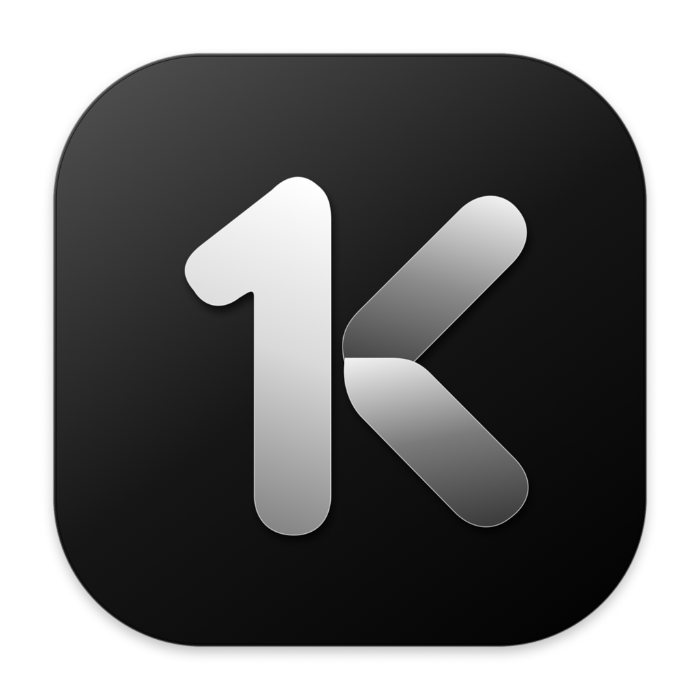
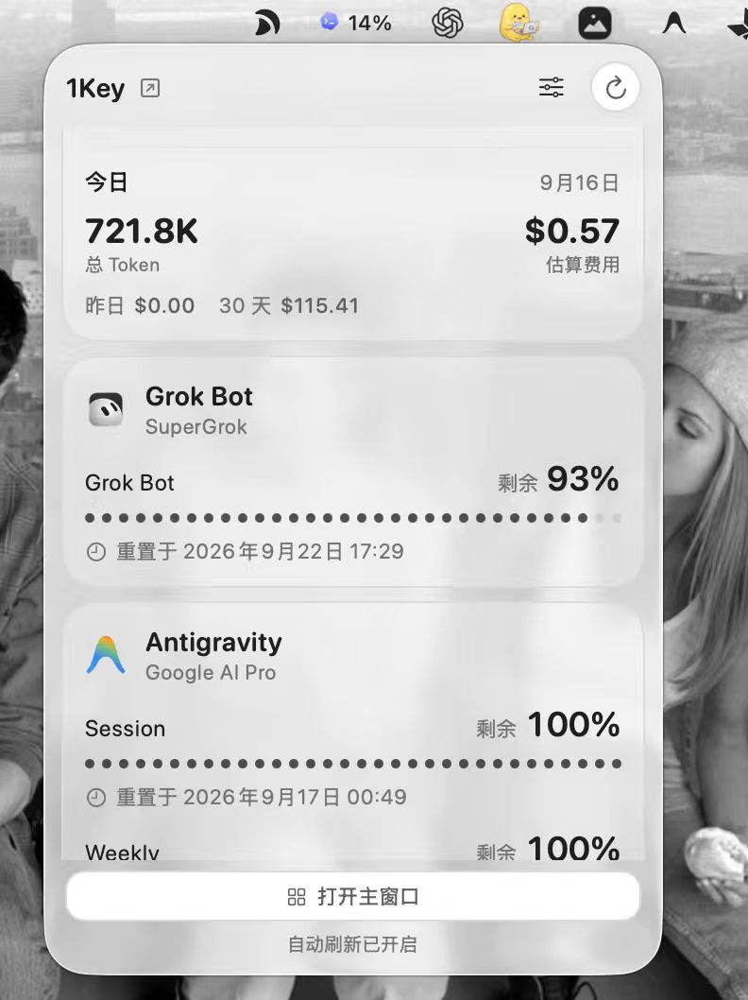
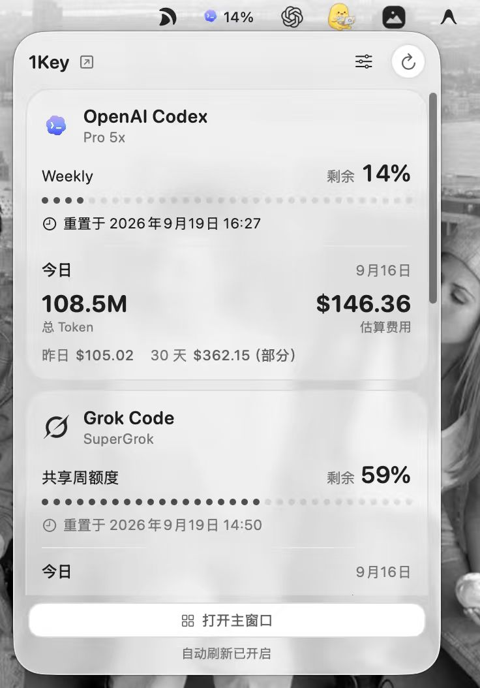
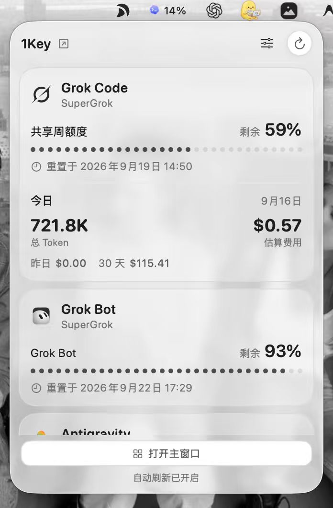

  

<h1 align="center">1Key</h1>

<strong>AI 额度、Token 与成本，一眼看清。</strong>

原生 macOS 工具，让常用 AI 服务的剩余额度和重置时间常驻菜单栏。

  <a href="https://github.com/isdou/1Key-Releases/releases/latest">下载最新版本</a> ·
  <a href="https://github.com/isdou/1Key-Releases/releases">更新记录</a> ·
  <a href="https://github.com/isdou/1Key-Releases/issues">反馈问题</a>

  
  
  

## 菜单栏预览

  
  
  

## 随手看额度，不必来回打开控制台

1Key 把分散的 AI 编程订阅集中到一处。打开菜单栏下拉，即可查看剩余额度、具体重置日期，以及本机记录中的 Token 用量和估算费用。

- **显示你关心的额度。** 账号和额度窗口分别选择，例如 Codex 只显示 Weekly，隐藏不常看的 Spark 窗口。
- **不同服务独立展示。** Grok Bot 与 Grok Code 分开显示；Antigravity 运行时优先读取本机额度服务，关闭后可使用授权过的云端凭据回退。
- **一致的黑白界面。** 支持浅色、深色及跟随系统，菜单栏与详情页使用圆点额度条。
- **无箭头玻璃面板。** macOS 26 使用原生 Liquid Glass；较早系统使用磨砂材质，并兼容系统“降低透明度”设置。

## 用了多少，也知道大概值多少

「用量与成本」把 Token 总量、估算费用和工具明细放在一张卡片里。

| 你想知道的 | 1Key 的展示方式 |
| --- | --- |
| 今天或最近用了多少 | 今天、7 天、30 天统一切换 |
| 哪几天用得最多 | 按天排列的点阵柱状图，悬停查看具体数值 |
| 用在哪个工具上 | 每个工具一行，显示 Token、占比和估算费用 |
| 没读到数据怎么办 | 显示空状态和数据来源检查入口，不把缺失记录当作零用量 |
| 新模型没有价格怎么办 | Token 继续统计，费用显示“暂无估价”或标记“部分” |

### 费用如何计算？

按模型的输入、缓存读取、缓存写入和输出 Token 单价估算。价格表内置离线副本，并在扫描用量时**最多每小时检查一次更新**；网络不可用时继续使用已有价格。

可更新价格数据来自 [OpenUsage 的公开模型价格补充表](https://github.com/robinebers/openusage/blob/main/Sources/OpenUsage/Resources/pricing_supplement.json)，其匹配项优先于 1Key 内置价格。当前已涵盖 GPT-6 Astra、Grok 4.6 等模型。

**估算金额是 API 等价价格，不是你的订阅账单，也不表示额外扣费。** 当前不从会话元数据自动识别快速模式或长上下文附加费。未知模型不会被默认当作免费。

## 服务与数据来源

| 功能 | 服务 / 来源 |
| --- | --- |
| 订阅额度 | OpenAI Codex、Antigravity、Grok Code、Grok Bot、Cursor、GitHub Copilot、Kimi Code、Trae 等；可用字段取决于服务接口与登录状态 |
| API 余额与连接 | DeepSeek 等 API 服务；不同供应商支持的查询能力不同 |
| 本机 Token 与成本 | 当前读取 Codex、Claude Code、Grok Code、Kimi Code、小米 MiMo 的受支持日志或本机记录 |

**额度与 Token 统计是两条独立的数据来源。** 能读取一个服务的剩余额度，不意味着一定能获取它的本机 Token 明细。Antigravity、Cursor、Trae 和 Grok Bot 当前未接入这张本机 Token 汇总表。

Grok Bot 当前复用本机 Cursor 登录状态，两者应使用同一账号。Antigravity 优先读取正在运行客户端的本机额度服务；客户端关闭时可通过“连接 → 授权 Antigravity 读取…”启用云端回退。

## 安装

1. [下载安装包](https://github.com/isdou/1Key-Releases/releases/latest)。
2. 打开安装包，将 **1Key** 拖入 **应用程序**。
3. 打开 1Key，按提示授权文件夹访问，即可扫描并连接本机已有的 AI 账号。

想调整菜单栏显示哪些账号和额度，可以前往 **设置 → 显示**。

支持 **macOS 14 及以上版本**，兼容 Apple 芯片和 Intel Mac。安装包已通过 Apple Developer ID 签名与 Apple 公证。

**更新：** 退出旧版后替换应用即可，账号与设置会保留。

## 刷新与隐私

- 启动会扫描已授权目录；后台定时刷新更新已添加账号。
- 刷新间隔可在设置中调整。启动、重新扫描和手动操作也可能额外触发刷新，因此并非严格每隔指定分钟才更新一次。
- 账号与用量数据保存在本机，敏感凭证通过 macOS 钥匙串保存；元数据导出不包含 API Key 或 Token。
- 额度请求发送给对应服务；价格更新只下载公共价格文件，不上传账号、对话或 Token 使用记录。

详见 [隐私说明](PRIVACY.md)。

## 反馈

欢迎通过 [Issues](https://github.com/isdou/1Key-Releases/issues) 提交建议或问题。请附上 1Key 版本、macOS 版本、服务名称和复现步骤；分享截图前遮住敏感信息，请勿提交完整 Token、API Key 或原始对话日志。

## 关于本仓库

本仓库用于发布 **1Key 安装包、更新说明和用户文档**。1Key 为专有软件，源代码不在本仓库公开，详见 [LICENSE](LICENSE)。
