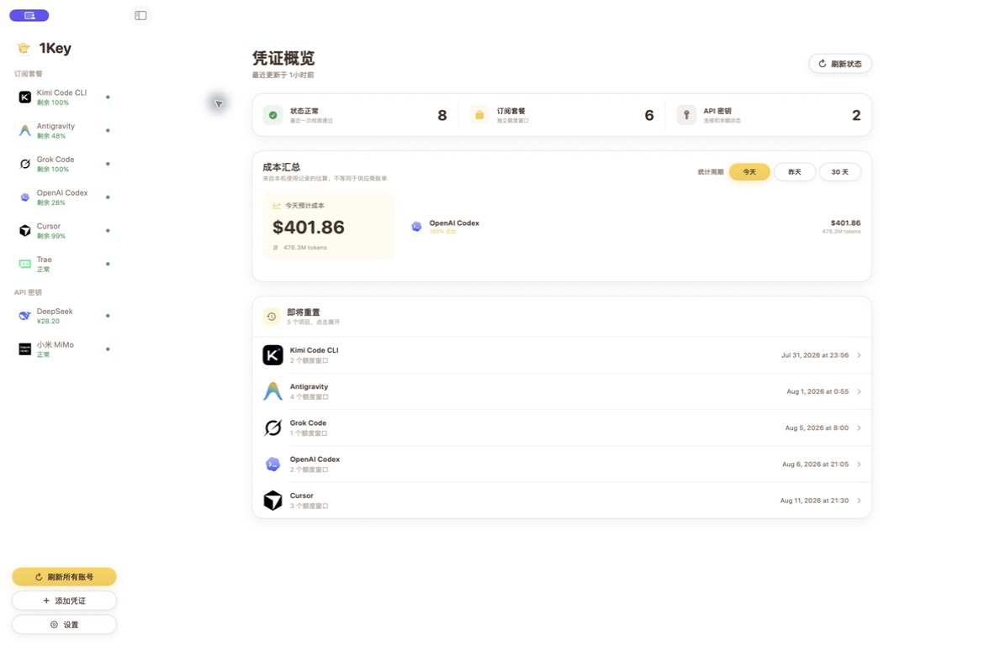
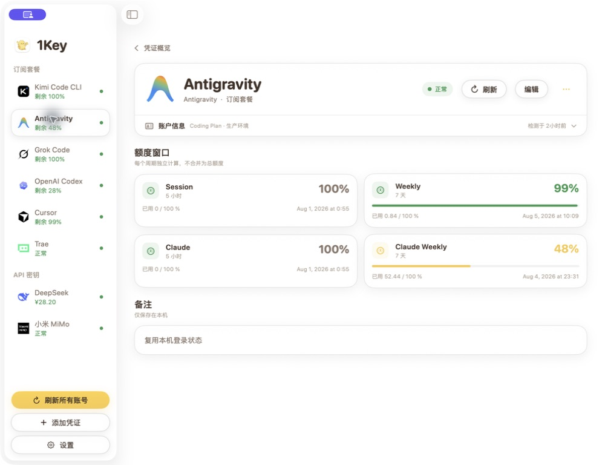
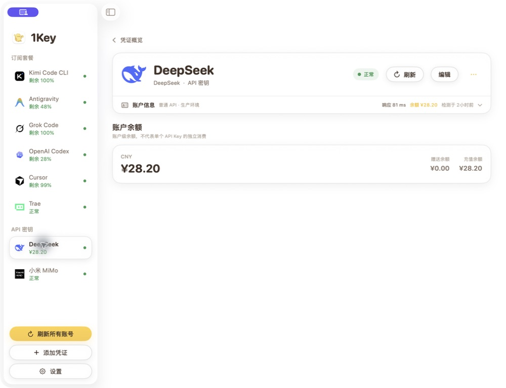
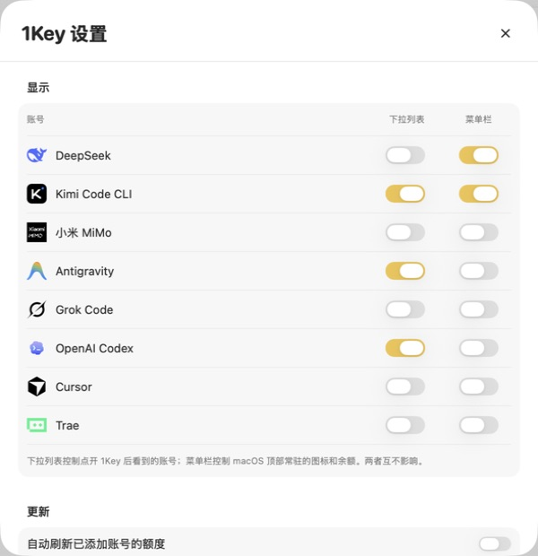
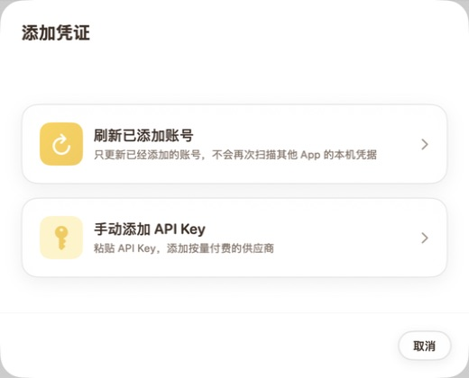

# 1Key

一站查看 AI 编程订阅额度、API 余额和本机使用成本的原生 macOS 工具。

[下载最新版本](https://github.com/isdou/1Key-Releases/releases/latest)

## 主要功能

- 集中查看 Kimi Code CLI、Antigravity、Grok Code、OpenAI Codex、Cursor、Trae 等订阅状态与额度窗口。
- 查看 DeepSeek 等 API 服务的账户余额、连接状态和响应时间。
- 在 macOS 菜单栏常驻显示用户自己选择的账号和剩余额度。
- 统计本机 AI 使用记录并估算 Token 与成本；估算数据不等同于供应商账单。
- 首次启动扫描一次本机登录配置，后续不会在启动时重复扫描；刷新只更新已添加账号。
- API Key 与凭证保存在本机钥匙串，导出的元数据不包含敏感凭证。

| 订阅额度 | API 余额 |
| --- | --- |
|  |  |

| 自定义菜单栏展示 | 添加账号 |
| --- | --- |
|  |  |

## 系统要求

- macOS 14 Sonoma 或更高版本
- 支持 Apple Silicon 与 Intel Mac
- 部分订阅额度依赖对应 AI 工具已经在本机登录

## 安装

1. 从 [Releases](https://github.com/isdou/1Key-Releases/releases/latest) 下载最新的 `1Key-*.dmg`。
2. 打开 DMG，将 1Key 拖入“应用程序”。
3. 首次启动时按提示完成一次本机账号扫描。

公开安装包使用 Apple Developer ID 签名并经过 Apple 公证。

## 隐私

1Key 的账号元数据、API Key 和本机使用记录保存在你的 Mac 上。详情见 [隐私说明](PRIVACY.md)。

## 反馈

请通过 [GitHub Issues](https://github.com/isdou/1Key-Releases/issues) 报告问题或提出功能建议。提交截图前请确认其中没有完整 API Key、Token 或其他敏感信息。

## 作者

[@isdou](https://github.com/isdou)

## 授权

1Key 是专有软件，公开仓库仅用于发布已编译安装包和用户文档，不提供源代码。详见 [LICENSE](LICENSE)。
